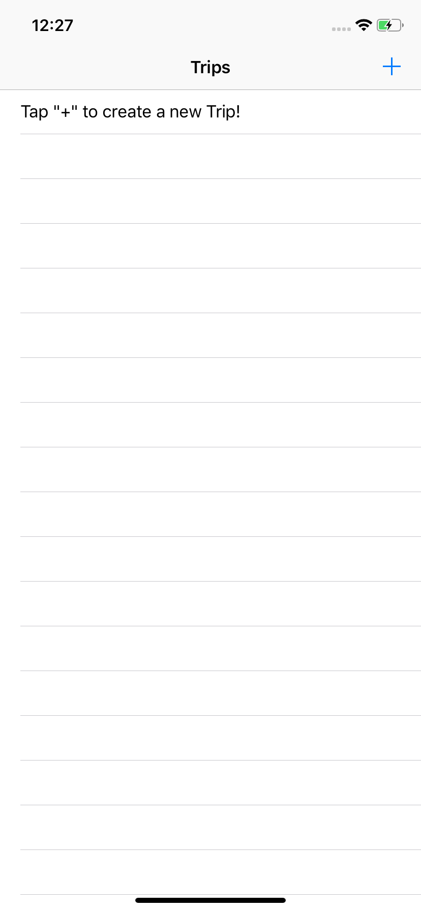
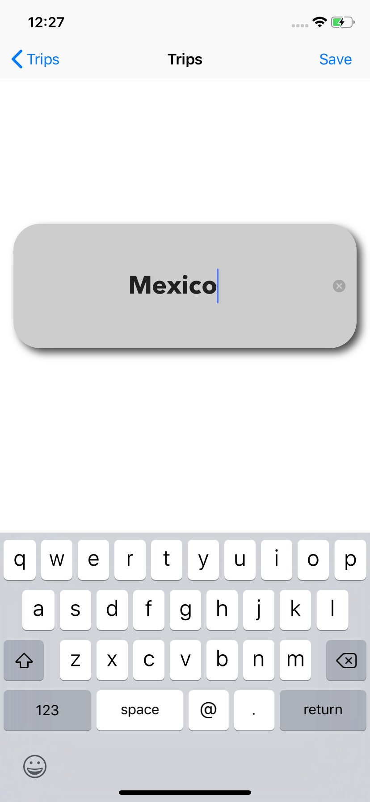
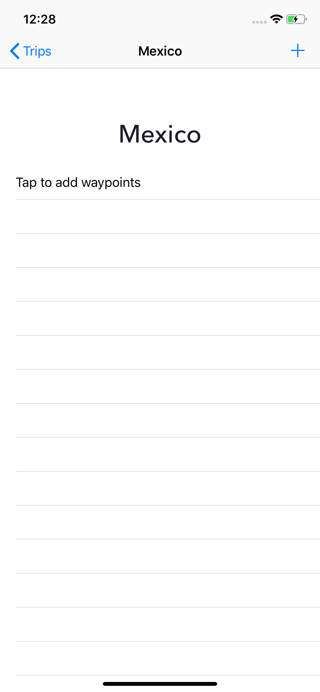
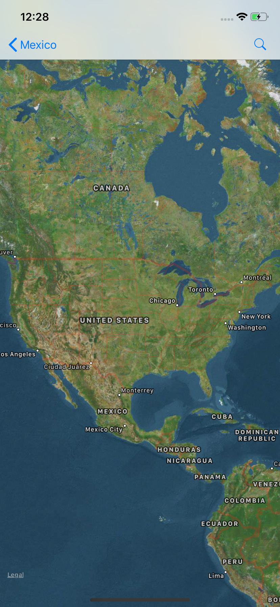
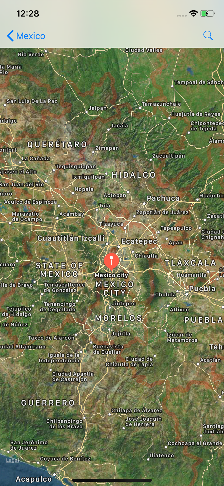
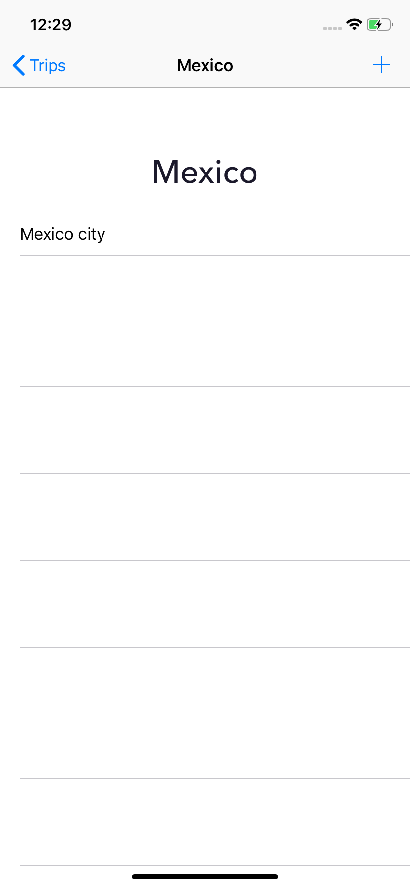

# TravelPlanApp

## How to use Timo's Travel app!

#### First Page

Here you will tap on the "+".

#### Start a trip!

Save the new trip name!

#### Tap on the newly created trip

Tap on "+" or the first cell.

#### Map!

Search an address or any location.

#### Pin

The pin will be placed on the geolocation of that item you searched. It will return an alert if nothing is found.

You can search for more place, but every search will add the location to your trip!

# Have Fun!
